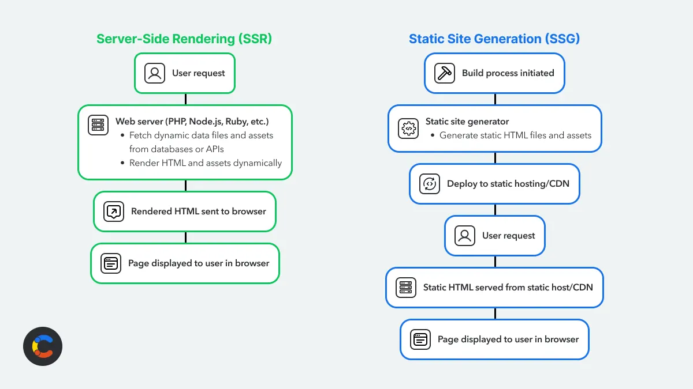

### SSG

How does the /out directory look like so that pasting it in a CDN makes a website work:

ALL is in index.html.

index.html works in a Next.js SSG site:

- **Build-time render**: Next pre-renders the page at build time and writes a complete static HTML file (out/index.html). **That file contains the fully rendered DOM (SEO/visible content).**

- **Static asset links**: CSS and fonts are linked in the head (e.g. /_next/static/css/... and /_next/static/media/...). Those files are produced during build and must be served alongside index.html.

- **Runtime scripts and hydration**: The <script> tags at the bottom load Next’s JS chunks. When those load the React app is "hydrated" — React attaches event handlers and makes the page interactive (client-side routing, galleries, toggles, etc.). Without JS the HTML still shows but interactivity is lost.

- **Chunk loading and resource hints**: Next injects resource hints and small bootstrapping snippets (you saw self.__next_f.push([...])) to tell the runtime which chunks/fonts/styles to fetch and to coordinate async chunk loading.

- **Client navigation**: After hydration, Next’s router can intercept links and do client-side navigation (fetching chunks/data) to avoid full page reloads when moving between pages — but each route also exists as a static HTML file in out/ so full reloads still work.

- **Where dynamic data matter**s: If the page depends on runtime data (not pre-rendered), it either uses client-side fetches after hydration or needs SSR/ISR — otherwise the build-time HTML is static.

What you need to serve it correctly:
- Serve the whole out/ directory from a static HTTP server so paths like /_next/static/... resolve.
- Set correct Content-Type headers and allow caching for static assets.
- If you want SPA-style fallback for client-side routes, configure your host to return index.html for unknown paths (only if your client-side router expects that).

Quick local preview (from project root):
````sh
# serve the out/ directory on port 3000
cd /Users/vasilvasilev/Documents/github\ macbook\ air\ m4/tilia/out
python3 -m http.server 3000
# or
npx serve -s .
````

If you want, I can list which chunks/assets that index.html expects (files under out/_next/static) or check that they exist.


### How does the website achieve not a full page reload on each redirect to a .html file?

The key lies in the ./_next (/out/_next/static/chunks/pages/ or /out/_next/static/chunks/app/). There lies the Next.js Router.

The core difference is that in a Next.js static site, the Next.js Router plays a critical and primary part in subsequent page navigation, meaning it is not just a standard <a> tag redirect.

Here is a breakdown of how it works in a Next.js application, even when using Static Site Generation (SSG):

1. The Initial Load: Standard <a> Tag
The very first time a user lands on your site (e.g., /), the browser receives the static HTML and the Next.js/React JavaScript bundle.

The links on this initial HTML page are technically standard <a> tags.

**However, when Next.js's JavaScript runs (a process called Hydration), it intercepts all internal <a> clicks.**

2. Subsequent Navigation: The Next.js Router (Client-Side)
After the initial load, every subsequent click on an internal link is handled by the Next.js Router on the client-side (in the browser). This is the key difference from a pure static site.

How the Router Works:
**Intercept**: When a user clicks a link (which looks like a normal <a> tag but is typically wrapped by Next.js's <Link> component), the browser does not perform a full page reload.

**Fetch Data**: The Next.js Router determines the target page and makes an Asynchronous Request (AJAX) to fetch the pre-rendered content for that page. This content is usually a small JSON file that was generated during the build and stored in the specialized \_next/data/ directory.

**Render**: The Router uses the fetched JSON data to efficiently update and re-render only the necessary React components on the existing page.

**Update URL**: The browser's URL is updated using the HTML History API, giving the illusion of a full page navigation without the slow reload.

